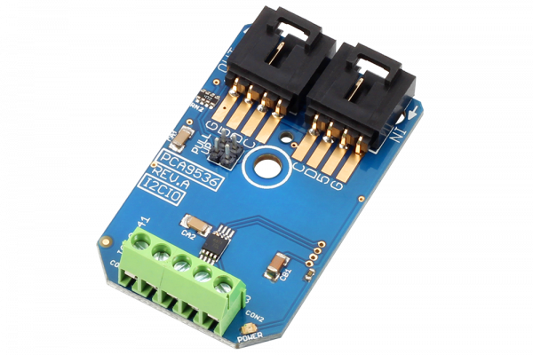

# PCA9536

The PCA9536 is a general purpose programmable 4-Channel digital input/output controller. In this design, we make all 4 pins available for user applications via a small terminal block. The address of the PCA9536 is fixed at 0x64, so only one of these devices may be attached to a single I2C port.
This Device is available from www.ncd.io 

[SKU: PCA9536_I2CS]

(https://store.ncd.io/product/pca9536-digital-4-channel-input-output-i2c-mini-module/)
This Sample code can be used with Arduino.

Hardware needed to interface PCA9536 sensor with Arduino

1. <a href="https://store.ncd.io/product/i2c-shield-for-arduino-nano/">Arduino Nano</a>

2. <a href="https://store.ncd.io/product/i2c-shield-for-arduino-micro-with-i2c-expansion-port/">Arduino Micro</a>

3. <a href="https://store.ncd.io/product/i2c-shield-for-arduino-uno/">Arduino uno</a>

4. <a href="https://store.ncd.io/product/dual-i2c-shield-for-arduino-due-with-modular-communications-interface/">Arduino Due</a>

5. <a href="https://store.ncd.io/product/pca9536-digital-4-channel-input-output-i2c-mini-module/">PCA9536 4Channel Input Output Module</a>

6. <a href="https://store.ncd.io/product/i%C2%B2c-cable/">I2C Cable</a>

PCA9536:

The PCA9536 is a general purpose programmable 4-Channel digital input/output controller. In this design, we make all 4 pins available for user applications via a small terminal block. The address of the PCA9536 is fixed at 0x64, so only one of these devices may be attached to a single I2C port.

Applications:

• Battery power applications.

How to Use the PCA9536 Arduino Library

The PCA9536 has a number of settings, which can be configured based on user requirements.
          
1.Address calling:The following command is used to call the PCA9536 module to begin the transmission.

            pca.getAddr_PCA9536_IO(PCA9536_IO_DEFAULT_ADDRESS);           // 0x41

2.Reset:The following command is used to reset the module.

             pca.Reset();
            
3.Sensor setup:The following command is used to setup the sensor.

             pca.setPinMode(PCA9536_IO_OUTPUT_PIN2, PCA9536_IO_MODE_OUTPUT);
             
